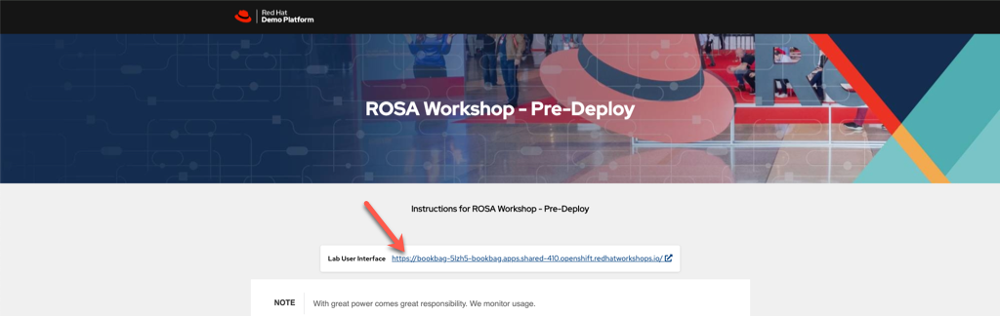

# ROSA Workshop - Red Hat Advanced Cluster Manager and Red Hat Advanced Container Security modules

The following content is adopted from the Red Hat Modern Application Development ( MAD ) Workshop - OPs track to work in conjunction with the ROSA Workshop.

## Prerequisites:
1. [MOBB ROSA Workshop](https://demo.redhat.com/catalog?item=babylon-catalog-prod/sandboxes-gpte.rosa-wksp-predeploy.prod&utm_source=webapp&utm_medium=share-link)

2. [Modern App Dev Roadshow - Ops Track](https://demo.redhat.com/catalog?item=babylon-catalog-prod/sandboxes-gpte.ocp4-acm-acs-ops-wksp.prod&utm_source=webapp&utm_medium=share-link)

## Instructions:

Sign into each workshop to get a environment assigned to you.  See a workshop faciliator if you need help.

### ROSA Workshop
The ROSA workshop can be used as a standalone workshop, follow the instructions in the lab guide.

### Modern App Dev Roadshow - Ops Track

The instructions below supercede the formal instructions in the workshop guide.  Feel free to go through the formal instructions if you would like, but the following instructions will incorporate the ROSA workshop cluster.

#### Log into the Modern App Dev Roadshow - Ops Track cluster
After you sign into the workshop, you will be presented a page like this.   Click on the OpenShift Console link and log in with the kubeadmin credentials listed.

#### Next follow these modules

[Vulnerability Scanning with ACS](acs-vulnerability-412.adoc)

[DevSecOps with ACS](acs-devsecops-412.adoc)

[Multicluster Management with ACM](acm-multicluster-412.adoc)

