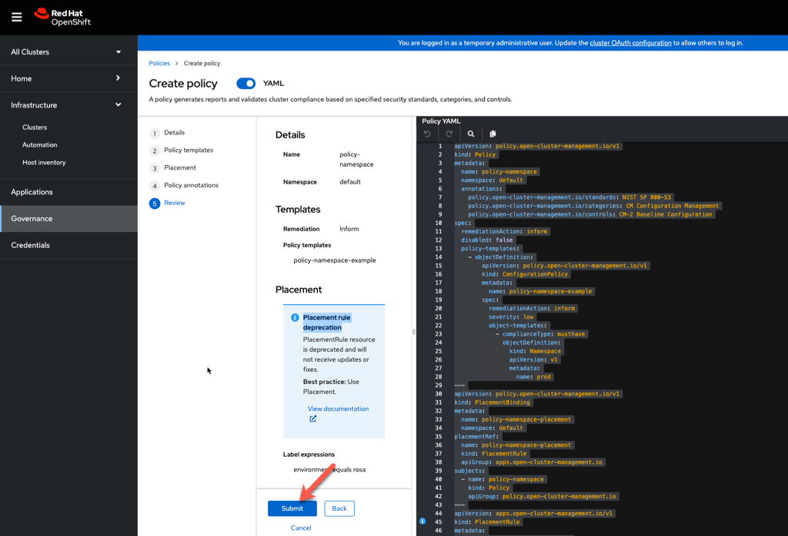

= Advanced Cluster Management for Kubernetes - RHACM

> Please note that you will need your running ROSA cluster from Day 1 in order to continue. If you missed Day 1 or have not set this up yet, please go ahead and create your ROSA cluster now. Creation time will take roughly 40 minutes.

== Working with ROSA clusters in ACM (Cluster Lifecycle Management)

At a high level, cluster lifecycle management is about creating, upgrading, destroying, and importing clusters in a multi-cloud environment.

Currently, you cannot create and manage the cluster lifecycle of ROSA clusters with ACM; however, you can import ROSA clusters into ACM. After a ROSA cluster is imported into ACM, you can use ACM to manage applications and policies for that ROSA cluster like you can for any other cluster.

Navigate to `local-cluster`; you should see the new ACM console when you select `All Clusters`.

Once there, you can proceed with the module.


== Importing a ROSA cluster into ACM

[start=1]
Once you have logged in to ACM, click on Import Cluster


##### Screen 1: Details

* Name:  `rosa-cluster`
* Cluster Set: `default`
* Additional labels: Leave blank for now
* Import mode: "Run import commands manually"

Click Next


##### Screen 2: Automation

[start=2]
Keep all the defaults.

Click Next

image::images/acm-images/acm-import-rosa-automation.png[]

##### Screen 3: Review

[start=3]
You can review the settings here and even toggle the YAML to copy out the CRD that will be created for you.

Click *Generate Command*.  This will generate a command we will run next on our ROSA cluster.


##### Cluster Overview

After clicking *Generate Command*, you will be brought to the Cluster Overview screen.

Click on *Copy Command*. This will copy a Base64 encoded command to register your cluster with ACM to your clipboard. _Tip: Paste this command into a text editor to save it for later._


[start=4]
=== Logging into your ROSA cluster

> You will need a running ROSA cluster in order to continue

Navigate to your ROSA Workshop environment from Day 1 and the beginning *Environment Setup* section, and ssh into the bastion.


When you first went through the ROSA lab, you created a `cluster-admin` user and saved the password to an environment variable named `ADMIN_PASSWORD`.

Verify the admin password is set in your terminal.
Run the following command and ensure that the applications are up and running


```bash
echo $ADMIN_PASSWORD
```

*Example Output*
```bash
CIvGW-5waw3-taJLz-Lyhw6
```


You will have a different value, but it should have returned something.

If you don't have this environment variable set, go back through the *Create Admin User* section of the ROSA lab.


Next, log into the ROSA cluster.

Set an environment variable for the ROSA API server

```bash
export ROSA_API=`rosa describe cluster --cluster rosa-${GUID} -o json | jq -r '.api.url'`
```

Log into the ROSA Cluster

```bash
oc login $ROSA_API --username cluster-admin --password $ADMIN_PASSWORD
```

*Output*
```bash
Login successful.

You have access to 99 projects, the list has been suppressed. You can list all projects with 'oc projects'

Using project "default".
Welcome! See 'oc help' to get started.
```


[start=6]
After logging into your ROSA cluster, run the ACM command you saved to your text editor from *Screen 3: Review*.


*Output*

```bash
customresourcedefinition.apiextensions.k8s.io/klusterlets.operator.open-cluster-management.io created
namespace/open-cluster-management-agent created
serviceaccount/klusterlet created
clusterrole.rbac.authorization.k8s.io/klusterlet created
clusterrole.rbac.authorization.k8s.io/klusterlet-bootstrap-kubeconfig created
clusterrole.rbac.authorization.k8s.io/open-cluster-management:klusterlet-admin-aggregate-clusterrole created
clusterrolebinding.rbac.authorization.k8s.io/klusterlet created
deployment.apps/klusterlet created
secret/bootstrap-hub-kubeconfig created
klusterlet.operator.open-cluster-management.io/klusterlet created
```


  
[start=7]
==== Navigate back to your ACM console and ensure the ROSA cluster has been successfully imported.


==== *Congratulations!* You have successfully imported a ROSA cluster into ACM.

== Creating and Managing Applications with Red Hat Advanced Cluster Management For Kubernetes

In the previous lab, you imported a ROSA cluster into RHACM, which you can now use to deploy applications.

Application Lifecycle functionality in RHACM provides the processes that are used to manage application resources on your managed clusters. This allows you to define a single or multi-cluster application using Kubernetes specifications but with additional automation of the deployment and lifecycle management of resources to individual clusters. An application designed to run on a single cluster is straightforward and something you ought to be familiar with from working with OpenShift fundamentals. A multi-cluster application allows you to orchestrate the deployment of these same resources to multiple clusters based on a set of rules you define for which clusters run the application components.

This table describes the different components that the Application Lifecycle model in RHACM is composed of:


|===
|*Resource*|*Purpose *

|Channel|Defines a place where deployable resources are stored, such as an object store, Kubernetes namespace, Helm repository, or GitHub repository.
|Subscription|Definitions that identify deployable resources available in a Channel resource that are to be deployed to a target cluster.
|PlacementRule|Defines the target clusters where subscriptions deploy and maintain the application. It is composed of Kubernetes resources identified by the Subscription resource and pulled from the location defined in the Channel resource.
|Application|A way to group the components here into a more easily viewable single resource. An Application resource typically references a Subscription resource.
|===


These are all Kubernetes custom resources, defined by a Custom Resource Definition (CRD), created for you when RHACM is installed. By creating these as Kubernetes native objects, you can interact with them the same way you would with a Pod. For instance, running +oc get application+ retrieves a list of deployed RHACM applications just as +oc get pods+ retrieves a list of deployed Pods.

This may seem like a lot of extra resources to manage besides the deployables that make up your application. However, they make it possible to automate the composition, placement, and overall control of your applications when you are deploying to many clusters. With a single cluster, it is easy to log in and run +oc create -f…​.+ If you need to do that on a dozen clusters, you want to make sure you do not make a mistake or miss a cluster, and you need a way to schedule and orchestrate updates to your applications. Leveraging the Application Lifecycle Builder in RHACM allows you to manage multi-cluster applications easily.

== Creating an Application


Prerequisites:

* Navigate to *Infrastructure → Clusters*
* Click on the *local-cluster*
* Click the *edit* button under *Labels* and add a *label* : `environment=acm`


* Repeat the same steps for the rosa-cluster with a *label*: `environment=rosa`
* Verify that the new clusters you built have the correct labels. It should be as follows:
** *local-cluster* - `environment=acm`
** *rosa-cluster* - `environment=rosa`


[start=1]
1. Navigate to *Applications*
2. Click *Create application*, select *Subscription*. 


[start=3]
3. Enter the following information:

** *Name*: `book-import`
** *Namespace*: `book-import`
** Under repository types, select the *GIT* repository
** *URL:*  https://github.com/rh-mobb/book-import.git[https://github.com/rh-mobb/book-import.git]
** *Branch*:  `master-no-pre-post`
** *Path:*  `book-import`

[start=4]
4. Verify that *Deploy application resources only on clusters matching specified labels* is selected and enter the following information. (
You do not need to include the colon (:) on the label):
** *Cluster Sets*: `default`
** *environment*: `rosa`

> *Cluster Sets*: `default` is the default cluster set that comes with ACM, while `global` always targets all clusters. You can also create your own Cluster Sets to target specific clusters.


[start=5]
5. Verify all the information is correct. Click *Create*

It will take a few minutes to deploy the application, *Click* on the *Topology* view and verify that *all of the check marks are green*.


[start=6]
6. Under the topology view, Select the *Route* and click on the *Launch Route* *URL*. This will take you to the Book Import application, which has several books available.
*NOTE* some browsers will default to https, and you will see a message that the application is unavailable. If you see this, change the url from https to http.


[start=7]
=== Verify the application has been deployed to the ROSA cluster. 

From the ROSA lab environment, ensure that you are still logged into your bastion host, and then run the following command:

```bash
oc get pods -n book-import
```

*Output*

```bash
NAME                          READY   STATUS    RESTARTS   AGE
book-import-d44c446cf-wwj9q   1/1     Running   0          42s
book-import-d44c446cf-xlg8n   1/1     Running   0          42s
```


Returning to the ACM console, feel free to experiment with the application.  Edit it and change the label to `environment=acm`.  What happens to the application?

You have now completed the overview of the *Application Lifecycle functionality in RHACM.*

You successfully deployed an application to a target cluster using RHACM. This approach leveraged a Git repository, which housed all the manifests that defined your application. RHACM then took these manifests and deployed them to the target cluster.

You also leveraged the power of labels and deployed the application to your imported cluster. Try playing with the labels and deploying this application to your local cluster. You can also create other clusters and or applications if you so desire.

=== Extra Credit

Try to deploy an Application on ACM using the ApplicationSet method. (Hint: This will require installing the OpenShift GitOps (ArgoCD) operator on the local cluster.) What do you see in the ArgoCD console after you do this?

== Governance, Risk, and Compliance (Security and compliance use case)

=== Creating Policies in ACM


At this point, you have completed the overview labs for Cluster Lifecycle and Application Lifecycle capabilities in RHACM. In the Cluster Lifecycle Lab, you learned how RHACM can help manage your Kubernetes clusters' lifecycles, including deploying new clusters and importing existing ones. You created new clusters in that lab and used your RHACM instance to manage them.

In the Application Lifecycle Lab, you continued exploring RHACM functionality and learned how to deploy and configure an application. You used the cluster that you added in the first module as the target for deploying an application.

Now that you have a cluster and a deployed application, you must ensure they do not drift from their original configurations. This kind of drift is a serious problem because it can happen from benign and benevolent fixes and changes or malicious activities that you might not notice but can cause significant problems. RHACM's solution to this problemis the Governance, Risk, and Compliance, or GRC, functionality.

==== Review GRC Functionality

It is important to define exactly what GRC is. In RHACM, you build and apply policies to managed clusters. These policies can do different things, which are described below, but they ultimately serve to govern the configurations of your clusters. This governance over your cluster configurations reduces risk and ensures compliance with standards defined by stakeholders, which can include security teams and operations teams

This table describes the three types of policy controllers available in RHACM, along with the remediation mode they support:

|===
|*Policy Controller*|*Purpose*|*Enforce or Inform*

|Configuration|Used to configure any Kubernetes resource across your clusters. Where these resources are created or configured is determined by the namespaces you include (or exclude) in the policy.|Both
|Certificate|Used to detect certificates that are close to expiring. You can configure the certificate policy controller by updating the minimum duration parameter in your controller policy. When a certificate expires in less than the minimum duration, the policy becomes noncompliant. Certificates are identified from secrets in the included namespaces.|Inform
|Identity and Access Management (IAM)|Used to receive notifications about IAM policies that are noncompliant. In the 1.0 version of RHACM, this checks for compliance with the number of cluster administrators you allow in your cluster.    |inform
|===

You need to create three different resources to implement the policy controllers:

|===
|*Resource*|*Function*

|Policy|The Policy defines what you want to check and possibly configure (with enforcement). Policies include a policy template which defines a list of objectDefinitions. The policy also determines the namespaces to which it is applied and the remediation actions it takes.
|Placement|Identifies a list of targeted managed clusters when using this Placement.
|PlacementBinding|Connect the policy to the PlacementRule.
|===


This is a complex topic, and this course only provides an overview. Please consult the https://access.redhat.com/documentation/en-us/red_hat_advanced_cluster_management_for_kubernetes/2.5/html-single/governance/index#governance[GRC product documentation] for more details on any of these policy controllers.

We'll work through a simple example and create a policy in the default namespace. For this, we'll need a little setup:

Navigate to *Clusters* and access the *ClusterSets* tab.


Click on the 3-dots button to the right of *global*, and then on *Edit namespace bindings* and add the *default* namespace


Next, navigate to the *Governance* screen and click *Create policy*.


Build a policy with the following information:

##### Screen 1: Details

* *Name*: policy-grc-cert
* *Namespace*: default (needs to match the namespace you enabled on the namespace binding)


Click *Next*.

##### Screen 2: Policy Templates

* Click on *Add policy template* and select *Certificate management expiration*
* Leave the defaults

Click *Next*.

##### Screen 3: Placement

Select *New placement* and choose *global* under *Cluster sets* (this option was enabled by editing the namespace bindings earlier.)

Alternatively, you can attempt to match clusters based on a label by clicking *Add label expression* and creating a label-matching expression.

When you are finished, click *Next*.

##### Screen 4: Policy Annotations

* Take the defaults on this screen.

Click *Next*.

##### Screen 5: Review

As you can see on the *Review* screen, this policy applies to every cluster in the *global* *ClusterSet*, and it will look for expired certificates in them. If a certificate is set to expire in less time than the *minimumDuration* specification, the policy will *inform* a non-compliant status.

* Review your changes and then click *Submit*.


2. Navigate to the https://github.com/rh-mobb/policy-collection/tree/main/stable/CM-Configuration-Management[GitHub Repo] with all the policies and select the https://github.com/rh-mobb/policy-collection/blob/main/stable/SC-System-and-Communications-Protection/policy-etcdencryption.yaml[Etcd Encryption]
3. On the *policy-namespace.yaml* click the *RAW* button on the policy.
4. Copy the raw YAML.
5. Under the *Create Policy* screen, enable the *YAML*. Copy and Paste the *RAW YAML* from the GitHub Repo

It should look something like this:

----
apiVersion: policy.open-cluster-management.io/v1
kind: Policy
metadata:
  name: policy-namespace
  namespace: default
  annotations:
    policy.open-cluster-management.io/standards: NIST SP 800-53
    policy.open-cluster-management.io/categories: CM Configuration Management
    policy.open-cluster-management.io/controls: CM-2 Baseline Configuration
spec:
  remediationAction: inform
  disabled: false
  policy-templates:
    - objectDefinition:
        apiVersion: policy.open-cluster-management.io/v1
        kind: ConfigurationPolicy
        metadata:
          name: policy-namespace-example
        spec:
          remediationAction: inform
          severity: low
          object-templates:
            - complianceType: musthave
              objectDefinition:
                kind: Namespace
                apiVersion: v1
                metadata:
                  name: prod
---
apiVersion: policy.open-cluster-management.io/v1
kind: PlacementBinding
metadata:
  name: policy-namespace-placement
  namespace: default
placementRef:
  name: policy-namespace-placement
  kind: PlacementRule
  apiGroup: apps.open-cluster-management.io
subjects:
  - name: policy-namespace
    kind: Policy
    apiGroup: policy.open-cluster-management.io
---
apiVersion: apps.open-cluster-management.io/v1
kind: PlacementRule
metadata:
  name: policy-namespace-placement
  namespace: default
spec:
  clusterConditions:
    - status: "True"
      type: ManagedClusterConditionAvailable
  clusterSelector:
    matchExpressions:
      - key: environment
        operator: In
        values:
          - rosa
----


click Next

[start=6]
6. Review the Policy Templates, Placement, and Policy Annotation sections, keeping the defaults and clicking Next.
We have already defined these values in the YAML file.

On the Review screen, click Submit



[start=7]
7. The Results screen appears on the next screen.

Once complete notice the violations you have, since we created this policy as a Inform only it will not fix any of the violations, lets go ahead and fix them

[start=8]
8. On the top of the policy click on the *Actions → Edit Policy*


9. Select *Step 2* and change the Remediation to *Enforce*
10. Select *Step 5* review that is under Remediation is set to *Enforce*
11. Click *Submit*

[start=12]
12. Navigate to the Results screen, allow the remediation to complete, _it may take longer to enforce the policy._


Now you have succesfully created a Policy to scan your clusters, if you would like to play with other policies please visit the https://github.com/rh-mobb/policy-collection[Policy Repo] for more Policies you can test out.

[start=13]
13. Navigate to your ROSA Environment

Run the following command to make sure the prod namespace is present

```bash
oc get ns prod
```

*Output*

```bash
NAME   STATUS   AGE
prod   Active   65s
```

This concludes the Red Hat Advanced Cluster Management lab, thank you for your time.
Find out more about https://www.redhat.com/en/technologies/management/advanced-cluster-management[Red Hat Advanced Cluster Manager]
